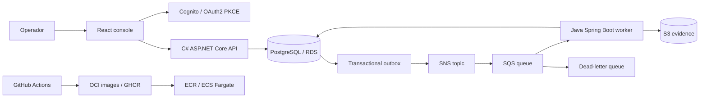

# Atlas Cloud Operations

[](https://github.com/jorgefprietol/atlas-cloud-operations/actions/workflows/ci.yml)

Plataforma de gobierno operativo cloud desarrollada con **C# / .NET 10 / ASP.NET Core, Java / Spring Boot y React / TypeScript**. Registra solicitudes, evalúa políticas de residencia y retención, conserva evidencia y ofrece trazabilidad desde la API hasta el procesamiento asíncrono.

Proyecto de ingeniería de **Jorge Prieto**, con infraestructura AWS declarativa, contenedores independientes y entrega automatizada. [Descripción para portafolio](docs/portfolio.md).

## Producto

- Consola web con indicadores reales, búsqueda, filtros, registro de solicitudes y detalle de auditoría.
- API autenticada con aislamiento por identidad, validación de entrada e idempotencia ante solicitudes concurrentes.
- Transactional outbox: solicitud, auditoría y evento se registran en una transacción PostgreSQL.
- SNS → SQS con reintentos, dead-letter queue y consumidor Java con deduplicación transaccional.
- Motor de políticas: respaldo mínimo de 30 días, residencia de datos confidenciales y restricción de exportaciones confidenciales.
- Informes JSON en S3 con claves y contenido deterministas para reintentos seguros.
- Docker Compose con PostgreSQL y emulación local de SNS, SQS y S3.
- GitHub Actions: pruebas, integración distribuida, análisis de secretos, imágenes OCI, escaneo de vulnerabilidades, SBOM y procedencia.
- Terraform para VPC en dos zonas, ECS Fargate, ALB/TLS, RDS Multi-AZ, Cognito, KMS, Secrets Manager, S3, CloudFront, WAF, CloudTrail y CloudWatch.

Las solicitudes representan **evaluaciones de políticas**: una decisión `validated` confirma cumplimiento, y conserva su evidencia. La plataforma no ejecuta respaldos ni publica servicios externos. Esa ejecución puede añadirse mediante adaptadores y aprobación independiente. [Arquitectura y límites](docs/architecture.md).

## Arquitectura



## Ejecutar localmente

Requisitos: Docker con contenedores Linux, Docker Compose y Python 3.10 o superior.

```powershell
git clone https://github.com/jorgefprietol/atlas-cloud-operations.git
cd atlas-cloud-operations
python scripts/init-env.py
docker compose up -d --build --wait --wait-timeout 300
```

Abre **http://127.0.0.1:18096**. Conecta el panel usando el valor de `DEV_API_TOKEN` del archivo `.env`. Las credenciales se generan aleatoriamente y no se incluyen en Git. El único puerto publicado escucha en loopback.

Compose usa una subred propia (`10.253.96.0/24`). Si coincide con una red del equipo, configura `ATLAS_SUBNET` en `.env` antes de iniciar.

Registra un respaldo con clasificación confidencial, región `us-east-1` y retención de 365 días. Se evaluará como `validated`. Una exportación confidencial se evaluará como `rejected`, con explicación y evidencia.

```powershell
python scripts/e2e.py
docker compose ps
```

La prueba distribuida comprueba autenticación, aislamiento entre identidades, validación, seis solicitudes concurrentes con una misma clave, conflicto de idempotencia, decisiones, auditoría, informe S3 y entrega duplicada.

## Desarrollo

Requisitos: .NET 10 SDK, Java 21 y Node.js 22.

```powershell
dotnet test tests/api/Atlas.Api.Tests.csproj -c Release
# JAVA_HOME debe apuntar a JDK 21.
mvn -B -f services/worker/pom.xml verify
cd web
npm ci
npm test
npm run build
```

Las dependencias NuGet y npm están bloqueadas; Terraform conserva su lockfile. Las acciones están fijadas a commits y Dependabot propone actualizaciones. Los contenedores de aplicación ejecutan procesos sin privilegios, con sistema de archivos de solo lectura y espacio temporal separado.

## AWS

El despliegue cloud se configura posteriormente. El repositorio **no crea recursos AWS desde CI ni almacena credenciales cloud**. [Guía AWS paso a paso](docs/aws-deployment.md) incluye el bootstrap ECR, backend remoto, variables GitHub, identidad OIDC, primera publicación y recuperación.

| Documento | Contenido |
| --- | --- |
| [Arquitectura](docs/architecture.md) | Consistencia, contratos, decisiones y límites |
| [AWS](docs/aws-deployment.md) | Preparación, variables y despliegue |
| [Operación](docs/runbook.md) | Incidentes, DLQ, recuperación y rotación |
| [Seguridad](SECURITY.md) | Autenticación, aislamiento y reporte de problemas |
| [Cobertura cloud](docs/cloud-capabilities.md) | Servicios implementados y alternativas arquitectónicas |
| [Portafolio](docs/portfolio.md) | Descripción verificable del proyecto |
| [API](contracts/openapi.yaml) | Contrato HTTP y ejemplos |

## Licencia

MIT. Consulta [LICENSE](LICENSE).
